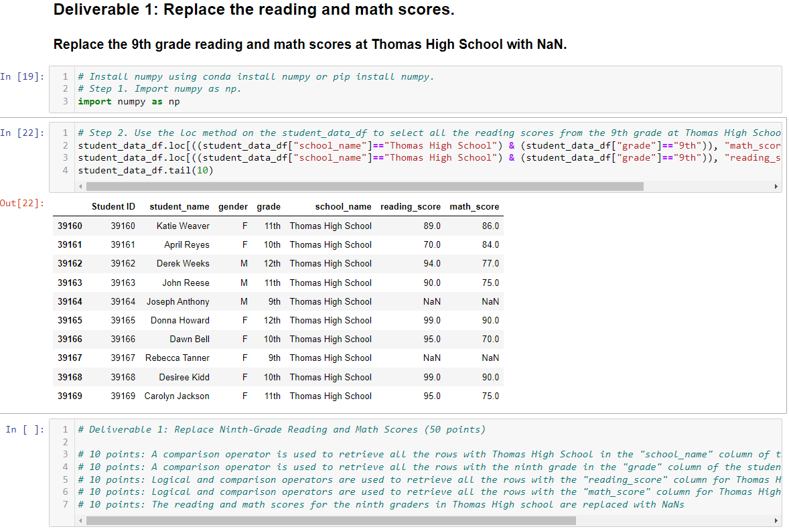
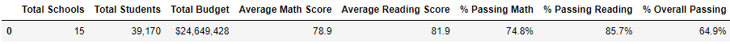
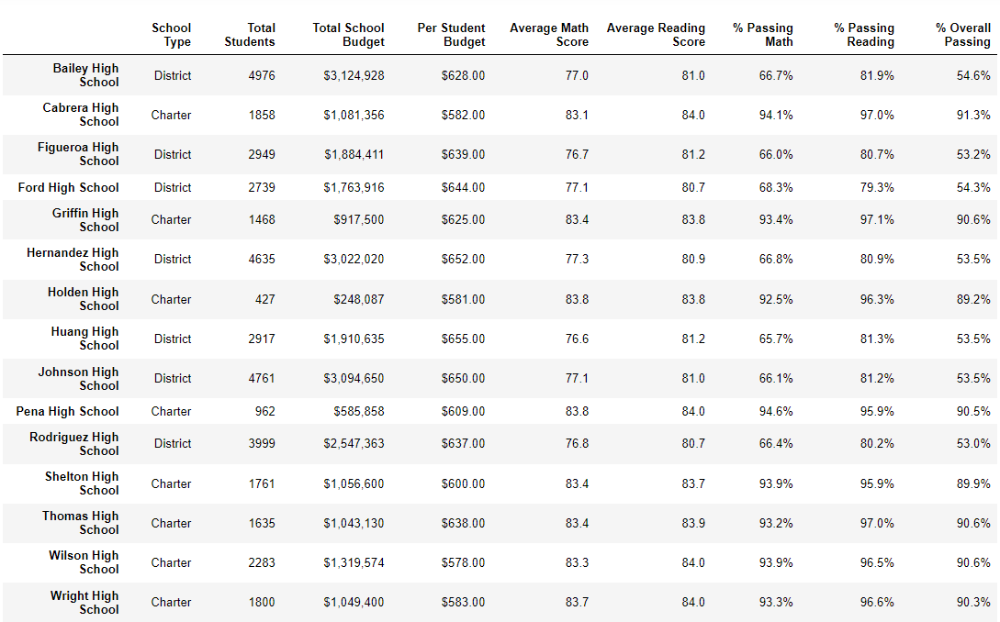
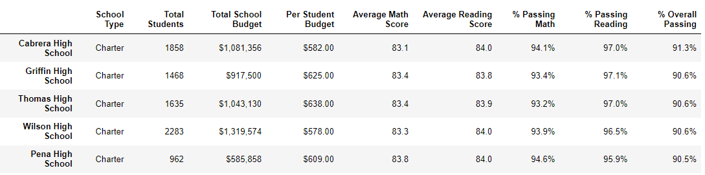
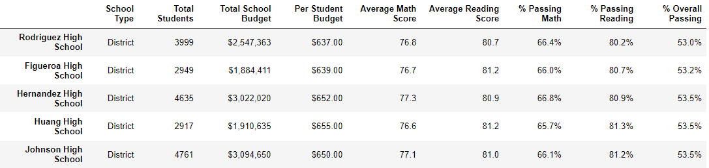
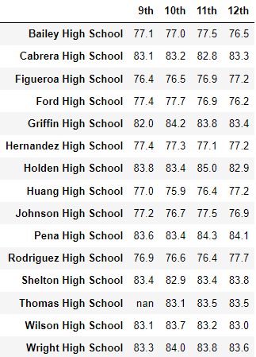
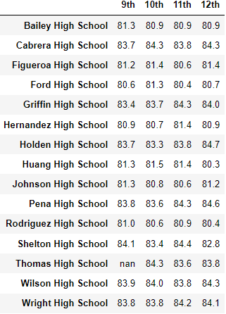
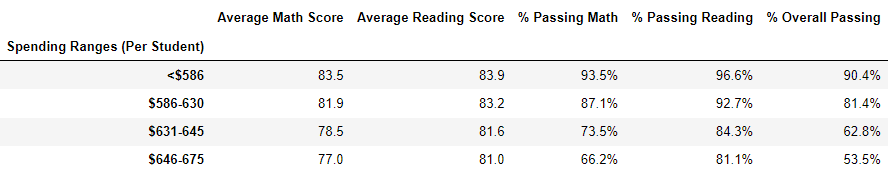
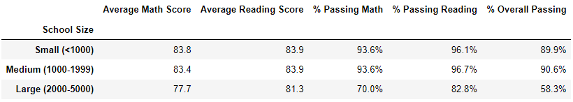
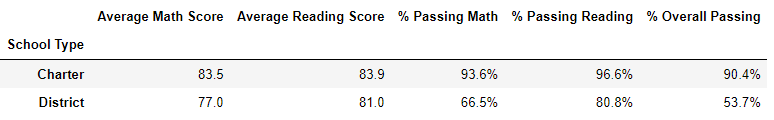

# School District Analysis
Below is a screenshot of the output of the Deliverable 1 requirements. For this analysis, the 9th grade math and reading scores at Thomas High School have been replaced with NaNs. The screenshot shows the code used to perform this analysis with explanatory comments to earn full credit of 50 points.

# Deliverable 2 Requirements
This repeats the school district analysis and updates the following required metrics in the PyCitySchools_Challenge.ipynb file:

The district summary DataFrame (3 pt)

The school summary DataFrame (3 pt)

The top 5 performing schools, based on the overall passing rate (2 pt)

The bottom 5 performing schools, based on the overall passing rate (2 pt)

The average math score for each grade level from each school (3 pt)

The average reading score for each grade level from each school (3 pt)

The scores by school spending per student (3 pt)

The scores by school size (3 pt)

The scores by school type (3 pt)

